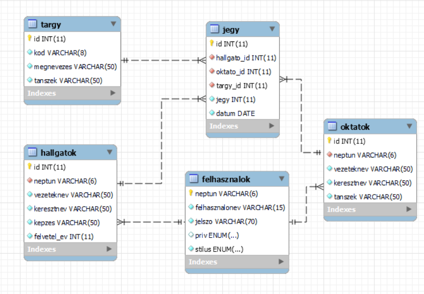

# Jegy nyilvántartó rendszer
    
# Specifikáció
## Feladat informális leírása
A feladat célja egy egyetemen az oktatók által, a hallgatóknak adott jegyek nyilvántartása. A rendszerben tárolni szeretnénk az összes hallgatót, az összes oktatót, a tantárgyakat és a jegyeket. Cél, hogy az oktatók és a hallgatók is beléphessenek a saját fiókjukba, amiben az oktatók az általuk adott jegyeket láthassák, tudhassák módosítani, törölni, illetve a hallgatók pedig csak a saját jegyüket láthassák.

## Elérhető funkciók
Az alkalmazás a következő funkciókat biztosítja:
 * Jegyek kezelése:
    * Új jegy létrehozása (oktató, admin)
    * Meglévő jegy adatainak módosítása (oktató [csak saját maga által adott jegyet], admin)
    * Jegyek törlése (oktató [csak saját maga által adott jegyeket], admin)
    * Az adatbázisban tárolt jegyek listázása (hallgató [csak a saját jegyeit], oktató [csak a saját maga által adott jegyeket], admin, tárgyadmin)
* Hallgatók kezelése:
    * Új hallgató és hozzá tartozó fiók létrehozása (admin)
    * Meglévő hallgatók adatainak módosítása (admin)
    * Az adatbázisban tárolt hallgatók listázása (oktató, admin, tárgyadmin)
* Oktatók kezelése:
    * Új oktató és hozzá tartozó fiók létrehozása (admin)
    * Meglévő oktatók adatainak módosítása (admin)
    * Az adatbázisban tárolt oktatók listázása (oktató, admin)
* Tárgyak kezelése:
    * Új tárgy létrehozása (admin, tárgyadmin)
    * Meglévő tárgyak adatainak módosítása (admin, tárgyadmin)
    * Az adatbázisban tárolt tárgyak listázása, keresés a tárgyak címe alapján (hallgató, oktató, admin, tárgyadmin)

## Adatbázis séma
Az adatbázisban a következő entitásokat és attribútumokat tároljuk:
 * Felhasználók: neptun kód, felhasználónév, jelszó, jog, mentett stílus
 * Hallgatók: neptun kód, vezetéknév, keresztnév, képzés, felvétel éve
 * Oktatók: neptun kód, vezetéknév, keresztnév, tanszék
 * Tárgyak: a tárgy kódja, neve, tanszék, amelyik a tárgyat tartja
 * Jegyek: hallgató id, oktató id, tárgy id, jegy, dátum

A fenti adatok tárolását az alábbi sémával oldjuk meg:

 